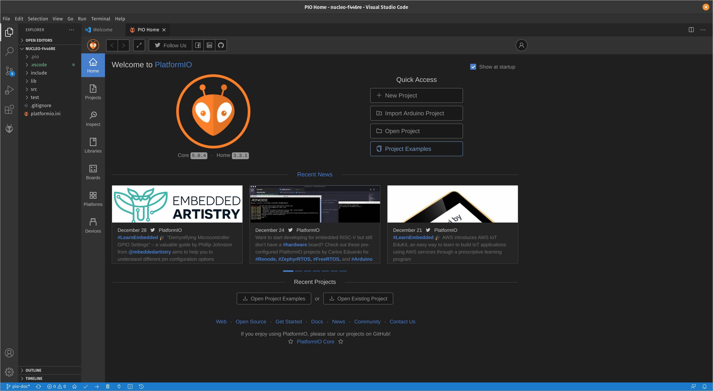

# Contributing to Zenith

The team has decided to make use of the GitHub Project feature to track issues
with a KanBan style chart. Issues will be created during weekly meetings. Once a
branch has been created for an issue, it will automatically be moved to the 'In
Progress' column in the Kanban chart. When the branch has been merged to master,
the issue will be automatically moved to 'Done'. 

## Development Environment

The Zenith repository is used for software only. Instructions pertaining to
setting up a hardware design environment can be found on the
[PCB Repository](https://github.com/qfsae/pcb) readme file.

### Installation

Software Development on the team will be carried out using
[PlatformIO](https://docs.platformio.org/en/latest/what-is-platformio.html).
PlatformIO is a tool delivered as an extension to the Visual Studio Code text
editor which allows for the uploading and debugging of software on the various
micro-controllers used on the car. Given below is a step by step breakdown to
getting started with PlatformIO. If you run into any problems with the steps below, please contact Ethan or Logan.

1. First, you will need Visual Studio Code installed. VSCode is available on
   Windows, Mac and Linux and can be downloaded
   [here](https://code.visualstudio.com/download).

1. Next, install PlatformIO IDE, which is built on top of VSCode. The
   instructions are given in the PlatformIO documentation
   [here](https://platformio.org/install/ide?install=vscode).

### Running Code

With the installation of PlatformIO complete, you are ready to start work on
software projects with the team. In this example, will be running code on an
STM32 Nucleo F446RE development board using a project template available in the
Zenith repository. The step by step process is given below. Note that in order
to run the example code, you will need a Nucleo development board connected to
your computer via USB. Please contact Ethan or Logan with technical questions or issues.

1. Start by cloning a copy of the Zenith repository if you do not already have a
   copy. 
    - If you do not have git installed, please download it
      [here](https://git-scm.com/downloads).
    - Clone the repository using the git command line interface (CLI) by typing
      the command `https://github.com/qfsae/zenith.git`.
    - Alternatively to the CLI, you can install [GitHub
      Desktop](https://desktop.github.com/). Cloning the repository with GitHub
      Desktop will automatically download the sub modules.
    - For a full picture of Git and its various functions, check out this Git
      and GitHub
      [handbook](https://www.notion.so/Git-GitHub-61bc81766b2e4c7d9a346db3078ce833).

2. With Zenith cloned, open a new VSCode window and select `File -> Open
   Folder`. Navigate to the templates folder of the Zenith repository and open
   the `nucleo-f446re` folder. The result should be that VSCode detects a PlatformIO project has been opened and the window should look similar to the screenshot below.

3. Next, open the `src` folder in the file tree on the left hand side of the
   editor and open `main.cpp`.

4. The code blinks an LED connected to a certain pin on the Nucleo board and
   repeatedly prints `Hello World!`. When writing code there are 3 important
   functions of PlatformIO required. The first is the build button, the second
   is the upload command and third is the serial monitor to see print statement
   output. Given below is a screenshot of each button found at the bottom
   toolbar of the editor highlighted in blue. The check mark builds / compiles
   the program, The arrow uploads the program to the board and the power outlet
   icon is the serial monitor.

5. Pressing the upload button should result in a success message in the bottom mounted terminal as shown below.

6. To verify the program is running, click the serial monitor and if the program uploaded successfully you will see the following.

With PlatformIO configured and tested you are ready to take on QFSAE software
projects! For debugging, print statements and the serial monitor can be used.
PlatformIO does provide fully featured debugging on hardware that supports it.
The nucleo board does have a debugger and QFSAE also has a custom debugger PCB
for this purpose. To get started with debugging code, take a look at the
PlatformIO documentation on using the debugger within VSCode
[here](https://docs.platformio.org/en/latest/plus/debugging.html#).

### Starting a New Project

1. In order to start a new QFSAE project, navigate to the templates folder of
   the zenith repository.

2. Select a project template corresponding to the hardware that is needed.
   Contact Ethan or Logan to discuss the hardware requirements for the project.
   If there is no existing matching template, we will help you in configuring a
   new PlatformIO project.

3. With the template project selected, copy the folder containing the project to
   the top level of the Zenith repository and rename the folder to match the
   name of your project (ex `steering-wheel`). This folder should contain all
   the project code.

## Submitting Changes on GitHub & Code Review
Starting in the Q21 season, the electrical team has decided to implement a code
review process to ensure that the master branch of this repository has the
latest working code that can run on the car. 

When starting a new contribution to the repository, please follow the steps
given below:

1. BEFORE writing any code or making commits, checkout a working branch for
   yourself from master branch. In command line git, this is done by doing `git
   checkout -b yourBranchName`. Each branch should be related to an issue in the
   GitHub backlog.

    Please follow this naming convention: `branch-name` (lower case with hyphens to separate each word)

    For example, a branch name could be: `updating-CAN-library`

1. Once you have finished your work and would like to submit your code for
   review, commit your latest changes using `git add .` and `git commit`. Once
   everything is committed you can push to the main repository with the command
   `git push -u origin yourBranchName`. You will be prompted for your
   credentials to complete the operation.

1. Follow the instructions on the GitHub documentation to [Open a Pull
   Request](https://docs.github.com/en/github/collaborating-with-issues-and-pull-requests/creating-a-pull-request).
   
1. Assign 2 team members to review the work. Projects will typically be assigned
   to 2 team members. Please ensure that either Brent, Logan or Ethan are
   assigned as one of the reviewers, and then your teammate as the other
   reviewer. 

1. Upon receiving feedback from the Pull Request, address and resolve any
   comments that are given. If there are comments that you don't understand,
   please use the GitHub conversation feature to ask questions. 

1. Once a senior team member has approved the Pull Request, they will merge the
   branch into master and delete it. 

1. Upon merging to master, GitHub Actions will attempt to build the project and
   run it against our test-suite. If the Continuous Integration pipeline fails,
   check the build logs and fix any issues. All projects on master should ALWAYS
   be passing our test suite.
